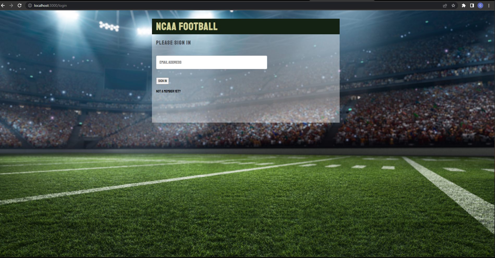

# College Football Weekly Pick 'Em


## Description

This app is similar to a traditional fantasy football app only instead of choosing players for a week, users can add specific college football teams to their roster for the week.  It will add the score from each team on the roster and come up with a total score which will then be shown on the weekly leaderboard to see how the user compares to others.

It was built with React, Javascript and CSS and uses ESPN's external API to bring in current scores, schedules, headlines and rankings.

It is also the first app I thought up myself start to finish with the aid of the instructors as work for the front-end part of NSS' web dev program.

More screenshots can be found in the ncaaf folder of this repo or click here:

https://github.com/galmodovar/capstone-ncaaf/tree/main/ncaaf

## Project Setup

Clone the repo using 

    > git clone git@github.com:galmodovar/capstone-ncaaf.git

Clone the api using 

    > git clone git@github.com:galmodovar/capstone-ncaaf-api.git

Once downloaded, open the terminal in the project directory, and continue with:

```
npm install
```

In a seperate terminal window, navigate to the repo that contains the api and run:

``` 
json-server -p 8088 database.json
```

Once the installs are complete and the json server is running:

In the project directory, you can run:

### `npm start`

Runs the app in the development mode.\
Open [http://localhost:3000](http://localhost:3000) to view it in the browser.

The page will reload if you make edits.\
You will also see any lint errors in the console.


